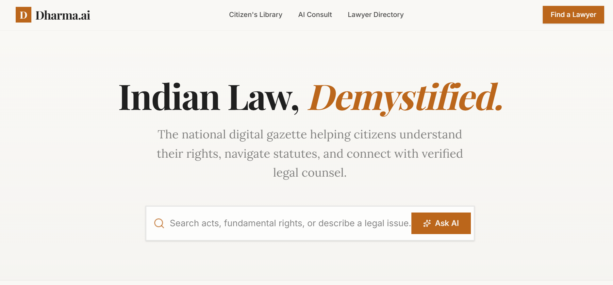
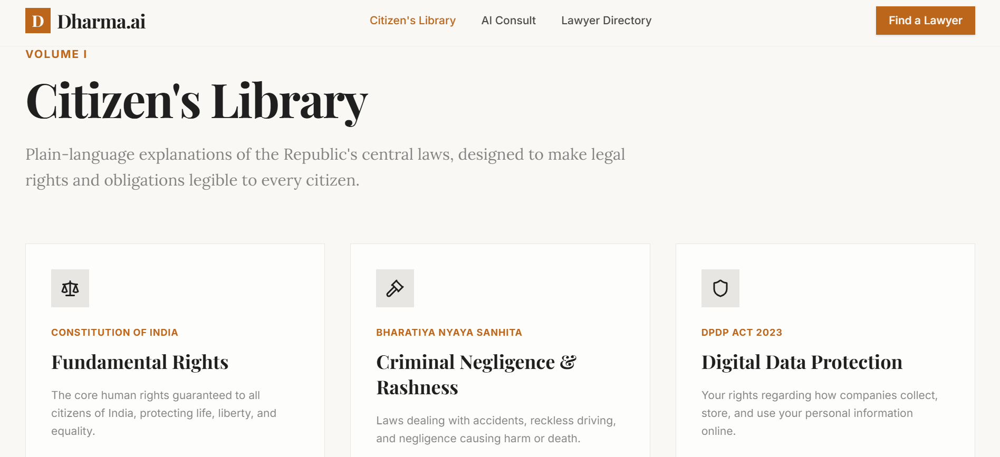

# ⚖️ DharmaAI — AI-Powered Legal Assistance Platform

[](https://opensource.org/licenses/MIT)
[](https://react.dev/)
[](https://expressjs.com/)
[](https://www.mongodb.com/)
[](https://openrouter.ai/)

> **DharmaAI** acts as a vital bridge between complex statutory law and everyday citizens. By translating dense legal frameworks into plain, human-readable rights and matching users with verified legal professionals, it ensures justice and legal literacy are never gatekept by complex jargon.

🔗 **Live Demo:** [https://dharmaai.onrender.com](https://dharmaai.onrender.com)

---

## 📖 Table of Contents
1. [Problem Statement](#-problem-statement)
2. [Project Screenshots](#-project-screenshots)
3. [Key Features](#-key-features)
4. [Tech Stack](#-tech-stack)
5. [Project Architecture & Workflow](#-project-architecture--workflow)
6. [Folder Structure](#-folder-structure)
7. [API Documentation](#-api-documentation)
8. [Installation & Setup](#-installation--setup)
9. [Future Enhancements](#-future-enhancements)
10. [Skills Demonstrated](#-skills-demonstrated)
11. [License & Author](#-license--author)

---

## 🛑 Problem Statement
For the general public, navigating legal systems or understanding central acts can be incredibly intimidating. Legal documentation is dense, vocabulary is specialized, and finding a verified professional matching a specific context is often inefficient. 

**DharmaAI flips the paradigm.** Instead of catering strictly to legal professionals, this platform places the end consumer at the center—demystifying legal concepts, increasing statutory literacy, and facilitating direct paths to representation.

---

## 📸 Project Screenshots

### Home Page


### Citizen's Library


---

## ✨ Key Features

| Feature | Description | Core Technology |
| :--- | :--- | :--- |
| **🤖 AI Legal Assistant** | Conversational chat interface responding to complex queries in plain language. | OpenRouter (Gemini 2.5 Flash) |
| **📁 Citizen's Library** | Curated breakdowns of essential laws (DPDP Act 2023, IT Act 2000, Consumer Protection). | React + Tailwind UI |
| **🔍 Lawyer Directory** | Dynamic matching matrix allowing users to look up legal practitioners by specialized field. | MongoDB Atlas |
| **📱 Unified Monorepo** | Coupled single-server architecture where the Express backend securely automates and hosts the built static React frontend out of a single port. | Express + Vite + `pnpm` Workspaces |

---

## 🛠️ Tech Stack

### Frontend
* **Core:** React, TypeScript, Vite, Wouter
* **Styling:** Tailwind CSS, shadcn/ui, Lucide Icons

### Backend
* **Runtime & Framework:** Node.js, Express (TypeScript)
* **AI Ecosystem:** OpenRouter API Integration (`Google Gemini 2.5 Flash`)
* **Database Layer:** MongoDB Atlas (Cloud Cluster Mongoose Wrapper)

### Tooling & Deployment
* **Monorepo Engine:** `pnpm` Workspaces
* **Cloud Infrastructure:** Render (Unified Web Service Application)

---

## 🏗️ Project Architecture & Workflow

### Architecture Diagram
```text
                 User
                  │
                  ▼
       React + Vite Frontend (UI)
                  │
          Asset Delivery / HTTP API
                  │
                  ▼
        Node.js + Express Backend
         (Single Port Server)
          │                │
          │                │
          ▼                ▼
    OpenRouter API    MongoDB Atlas
          │
          ▼
   Google Gemini 2.5 Flash

 ---

 ### Application Workflow

1. User interacts with the clean **DharmaAI** interface to state a grievance or ask a structural legal question.

2. The UI pushes a contextually anchored query structure downstream via **REST endpoints**.

3. The **Express Backend** appends system instructions/guardrails and invokes **OpenRouter**.

4. **Gemini 2.5 Flash** processes the legal query, generating an accessible, plain-text response structure.

5. Concurrent requests for local bar directory matching pull directly from mapped database collections on **MongoDB Atlas**.

6. Static assets are seamlessly bundled directly into the backend distribution wrapper for simple unified pipeline updates.

---

## 📂 Folder Structure

```text
DharmaAI/
├── artifacts/
│   ├── dharma-ai/          # React + Vite Frontend Application
│   │   ├── src/
│   │   ├── public/
│   │   ├── package.json
│   │   └── vite.config.ts
│   └── api-server/         # Express REST Engine & Static Asset Host
│       ├── src/
│       ├── routes/
│       ├── lib/
│       ├── dist/           # Compiled Production Build + Bundled Frontend Assets
│       └── package.json
├── package.json
├── pnpm-workspace.yaml
├── README.md
└── .env.example
```

---

# 🌐 API Documentation

## AI Chat

**POST** `/api/chat`

**Request**

```json
{
  "message": "Explain consumer rights in India"
}
```

**Returns:** AI-generated legal explanation block.

---

## Get Lawyers

**GET**

```text
/api/lawyers
```

**Returns:** Array containing all registered verified legal practitioners.

---

## Search Lawyers

**GET**

```text
/api/lawyers?specialization=criminal
```

**Returns:** Filtered array of lawyers matching the specific target specialization fields.

---

# 🚀 Installation & Setup

## Prerequisites

- Node.js (v22+)
- pnpm (`npm install -g pnpm`)

---

## Clone Repository

```bash
git clone https://github.com/abhini1516/DharmaAI.git

cd DharmaAI
```

---

## Configure Environment Variables

Create a `.env` file inside `artifacts/api-server/` using `.env.example`:

```env
OPENROUTER_API_KEY=your_openrouter_api_key
MONGODB_URI=your_mongodb_connection_string
PORT=3001
NODE_ENV=development
```

---

## Install Workspace Dependencies

```bash
pnpm install
```

---

## Build and Launch the Unified System Local Host

To compile the monorepo workspace frontend components and inject them right into the active running backend port:

### Build Frontend Assets

```bash
pnpm --filter @workspace/dharma-ai build
```

### Launch Complete Application Server

```bash
cd artifacts/api-server

pnpm run dev
```

Open your browser and navigate to:

```text
http://localhost:3001
```

---

# 🔮 Future Enhancements

- 🎙️ Voice-enabled legal assistant
- 📄 OCR for legal documents
- 📑 PDF summarization
- 🌐 Multilingual support
- 🔐 User authentication
- 💬 Conversation history
- 📅 Lawyer appointment booking
- ⚖️ Case law search

---

# 🧠 Skills Demonstrated

- Full-Stack Engineering: Designing resilient client-server modules with Express and React inside a modern workspace ecosystem.

- Intelligent Prompt Engineering: Structuring system contexts to keep AI legal breakdowns safe, sound, and accessible for general users.

- Database Management: Scalable schema building and querying using MongoDB cloud clusters.

- CI/CD Cloud DevOps Setup: Compiling custom asset pipelines to enable continuous multi-tier single service delivery framework.

---

# 📄 License

This project is licensed under the **MIT License**.

---

# 👤 Author

**Abhini S**

Pre-Final Year Computer Science Engineering Student (Data Science)

- GitHub: https://github.com/abhini1516
- LinkedIn: https://www.linkedin.com/in/abhini-s-220345281/
- Email: abhiniprojects7@gmail.com  